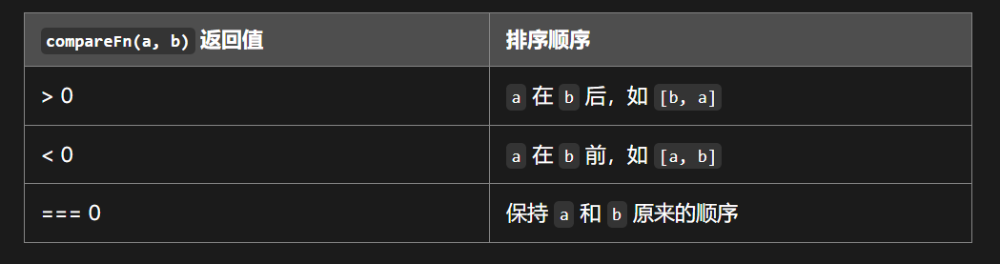

<!--
 * @Author: xinyue
 * @Date: 2023-04-19 16:47:48
 * @Description: algorithm 问题
-->

记录自己遇到的算法问题

1. 随机打乱数组

> 输入：无序的数组
> 输出：打乱后的数组
> 背景知识：Array.prototype.sort
>
> 

```javascript
function randomArr (arr) {
    return arr.sort((a, b)=> {
        // [0, 1)
        return Math.random() - Math.random();
    })
}
```
2. 二分查找元素

> 输入：有序的数组 指定元素 arr value
> 输出：arr中刚比value大一点的那个数的索引，没有返回-1
> 背景知识：while循环

```javascript
let arr = [1, 3, 5, 7, 9, 11, 22];
function sortNumber (arr, value) {
// 左值left 数组中间位置的值middle 右值right 要查找的值value
// 想要找到离得查找的值最近的那个右侧的数 
// 当 中间值小于要找的值（判断不准确 只能知道）
// 当 左值小于右值
 
//  if 中间值 > 查找值
//      right = middle;
//         右值 == 中间值 左值等于中间值 跳出循环
//  else if 中间值 < 查找值
//      left = middle
//  else 中间值 = 查找值
//     return 中间值
//     查找值 4
//     1 22 左右值比较 第一次进入循环
//     3 中间索引 [1, 3, 5, 7, 9, 11, 22]
//     1 7 22 左值 中间值 右值
//     更新后 
//     1 5 7 左值 中间值 右值

//     2        第二次进入循环 1, 3, 5, 7
//     1 5 7

//     1        第三次进入循环 1, 3, 5
//     1 3 5

//     3 5
//     1        第四次进入循环 3, 5
//     3 5 5
let left = arr[0];
let lenght = arr.length;
let right = arr.at(-1);
    while(left < right) {
        let middle = 
    }
}
```